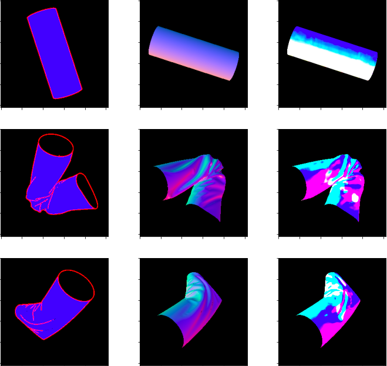

# Wrinkles-prediction

I tried to predict how the wrinkles of a shirt(center) will be realized when its silhouette(left) is given.
In this project, U-Net model with 20 layers is used.
And the numbers of datasets are 4,000, 1,000, 16 for training, validation, test, respectively.

The result is so rough at present, that it needs further improvements.

